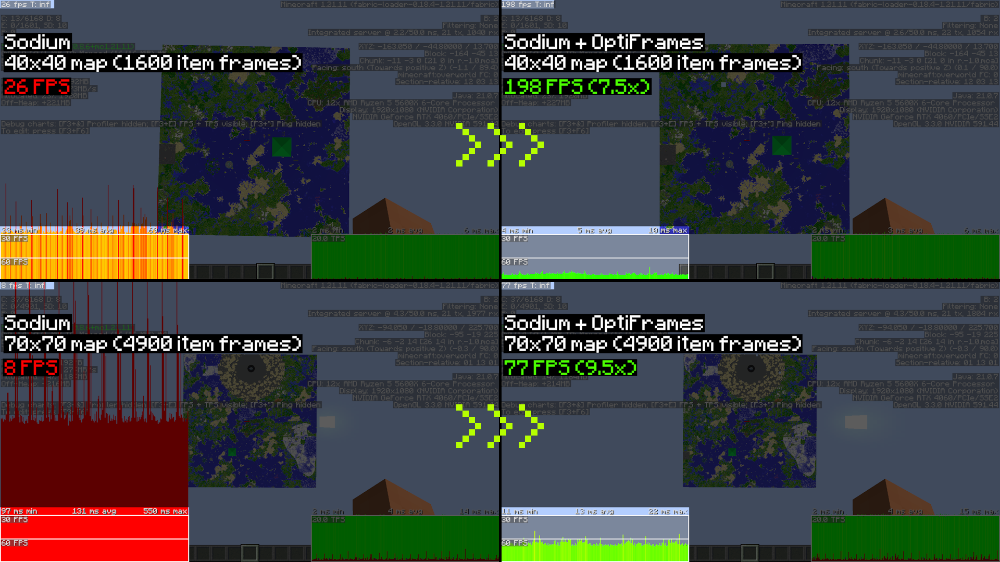

# OptiFrames

A lightweight, client-side Fabric mod that makes large map displays render cleaner and smoother without changing their appearance.

## Performance Test with 40x40 and 70x70 map

Test are made with Sodium but you can expect same gain without it.

## Why use OptiFrames?

- **Optimized rendering**: hides redundant borders between adjacent maps.
- **Texture Atlas**: all map textures are packed into a shared atlas, drastically reducing GPU draw calls.
- **FPS boost**: expect up to **9x FPS increase** with large maps.
- **Map decoration support**: player markers, banners, and other map icons still render correctly.
- **Lightweight**: designed to work well alongside Sodium and Iris.

## Installation

1. Download the latest `optiframes-<version>.jar` from the Modrinth/Curseforge page.
2. Place the JAR in your `mods` folder.
3. Start Minecraft using a Fabric profile.

## Configuration

You can configure the mod with [Mod Menu](https://modrinth.com/mod/modmenu):
- **Enable/Disable** the mod entirely
- **Frame borders** — toggle border rendering between maps for extra performance
- **Border texture** — toggle the wood texture on borders (solid color when off)
- **Atlas size** — choose the atlas texture size, Bigger = more maps per draw call. Default 4096 works great for most setups.

## Compatibility

- Client-side only — safe to use on any server.
- Works well with Sodium and Iris.
- Tested on every available version.

## Troubleshooting

- Mod not appearing in Mod Menu: confirm the JAR is in `mods` and you launched the Fabric profile.  
- Crashes: please attach `latest.log` and any `crash-reports` when opening an issue.